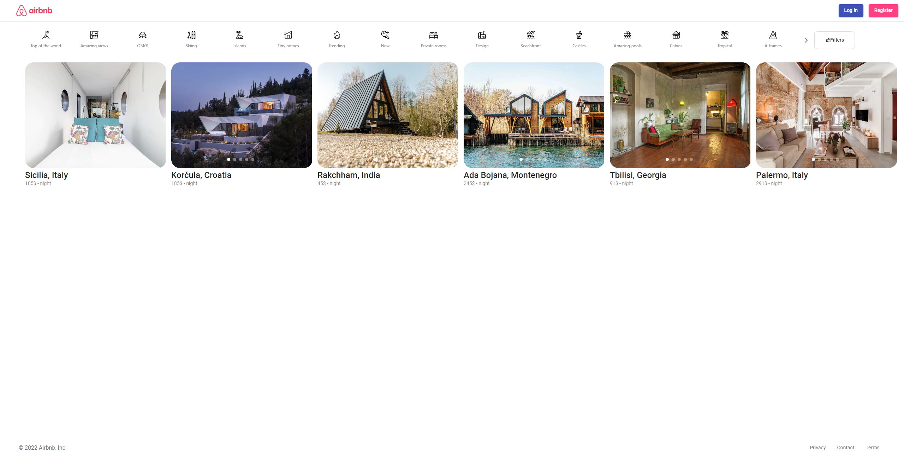

## Table of contents

- [General info](#general-info)
- [Technologies](#technologies)
- [Setup](#setup)
- [Website functionalities](#Website-functionalities)

## General info

this project is clone of airbnb as a part of angular development course.

## Technologies

Project is created with:

- Angular 14
- typescript
- rxjs
- ngrx
- bootstrap
- primeNG
- sweetalert
- font-awasome

## Setup

To run this project, install it locally using npm:

```
$ clone github reposity
$ npm install
$ ng serve

```

## Website functionalities

this segments explains how website works and what you can do with it.

- view page
  when you first visit website, initial page looks like this.
  

header page has clickable buttons

- airbnb logo, which takes you to home(initial page)
- log in , lets you log in to your account
- register, lets you register account
  

filter that lets you filter hotels based on certain characteristics, these characteristics are associated with icons and text


filter button at the right side of the filter bar displays filter modal, that lets you filter hotels with more specific data


card display area, where hotels are displayed, hotels are taken from API and then displayed on view page


footer of website, which has 3 buttons which take you to following pages

- privacy
- contact
- terms
  

- privacy

by clicking one of the hotels, you will be taken to inner page where hotel information is displayed in detail, you can also make a reservation from this page.


hotel name and image gallery, you can scroll through images with image slider.


hotel details, description, what hotel offers, each section has button to get more detailed information with modal


calendar which lets you pick up range of days you want to reserve hotel, also map which shows hotel location, and host information


inner page footer


hotel reservation area that lets you pick date range and number of guests children and pets you want to reserve. reserve button takes you to payments page where you will finalize you reserve.


